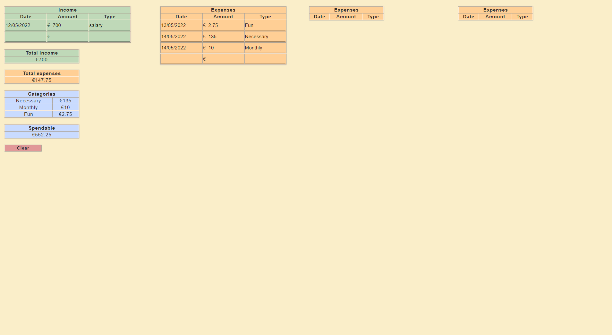
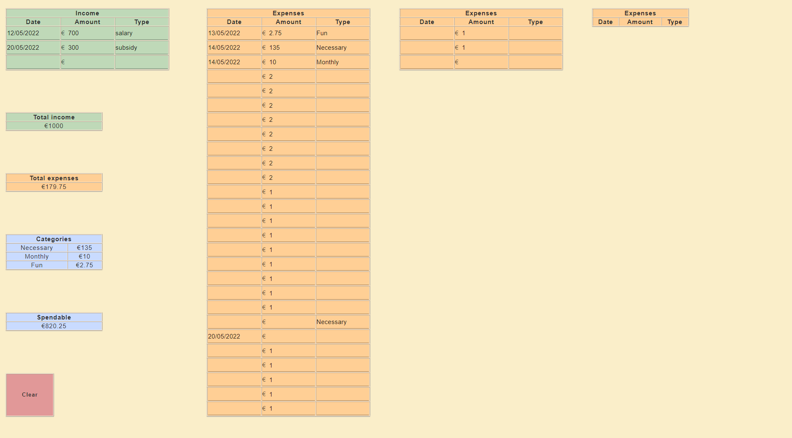

# Budgit
## TJ Leeuwerik

### Description
This is Budgit. It is a small budgeting app designed for personal use by me. Its purpose is to quickly give a complete overview of all expenses and income as input by the user, and consequently to check how much money you have left. Categories help to indicate where most of your money is going. 

### Screenshots

### Screencast
<iframe src="https://drive.google.com/file/d/1BIwnugPBkTrF3P4GIBNB0byIsMzZxo34/preview" width="640" height="480"></iframe>

### Acknowledgement
Thank you to Jelle for everything! This project makes use of Material UI components.
