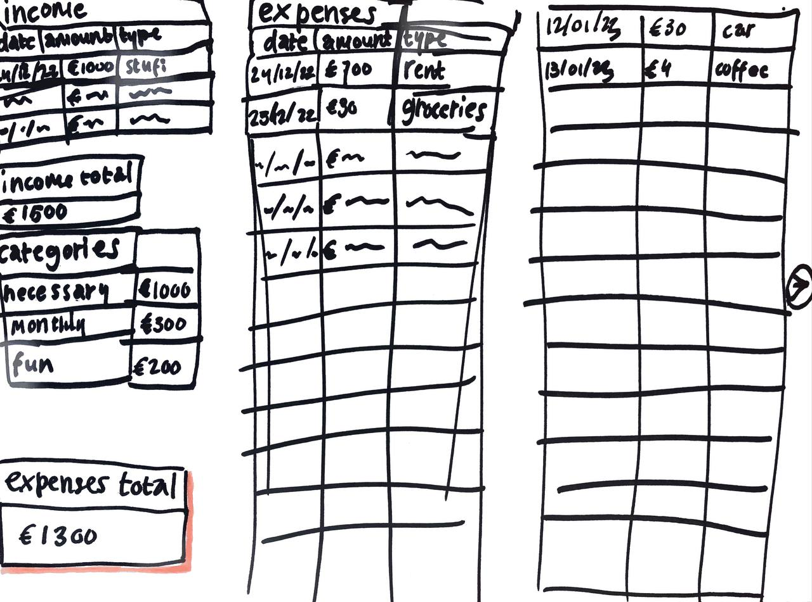

# Budgeting
## TJ Leeuwerik

### Probleem
Mijn financiën houd ik bij in een Excel-sheet. Dit is eenvoudig te overzien, en makkelijker te manipuleren en goedkoper dan beschikbare budgetteer-apps. 
Echter, is het ook niet de meest handige oplossing. Ik voer alle data met de hand in, moet vaak extra klikken vanwege de begrenzing op soorten invoer (zoals
het euro-teken) in Excel, en heb ook extra moeite moeten doen om via Excel mijn uitgaven te sorteren en kleurcoderen. Ik denk dat dit efficiënter kan,
en dat deze problemen kunnen worden opgelost door een eigen webapplicatie te maken. 

### Oplossing
Deze webapplicatie zal een overzicht helpen te creëeren van de financiën van de gebruiker. De applicatie zal input accepteren voor waardes als inkomsten en uitgaves,
de datum waarop deze zijn gedaan, de soort inkomst/uitgave en de bredere categorie waar deze onder valt. Met deze data wordt er dan ook een totaalbedrag aan inkomsten
en uitgaves per (fiscale) maand en categorie teruggegeven. Structuur:
- Pagina 1
    - Div tafel met inkomsten
    - Div tafel met uitgaven
    - Div tafel met categorieen en totalen
    - Div met totaal inkomsten
    - Div met totaal uitgaven
    - Div met bedrag over
- Pagina 2
    - Div tafel met verwachte inkomsten
    - Div tafel met verwachte vast uitgaven
    - Div totaal verwachte inkomsten
    - Div totaal verwachte uitgaven
    - Div totaal verwacht besteedbaar inkomen

### Schetsen

### Libraries
Ik ga wanneer ik meer competentie heb en dus beter weet wat ik wil eens kijken naar deze libraries: https://technostacks.com/blog/react-component-libraries

### Gelijksoortige apps
Ik wil graag een web app voor de computer (geschikt voor een monitor) maken, waar de meest eenvoudige budget apps nu gemaakt zijn voor smartphones (bijvoorbeeld Dyme of Mint). Programma's voor de PC zijn vaak weer te complex voor mijn doeleinde, en vaak zijn deze ook vrij duur. Ik wil een simpele applicatie die ik gratis vanaf mijn PC kan gebruiken, waarbij ik een onderscheid wil kunnen maken specifiek wat een uitgave is (bijvoorbeeld koffie) en dan in welke categorie dit valt (bijvoorbeeld luxe aankoop of een uitstapje), waarbij die soort en categorie uitgave invulbaar zijn zodat het geheel customizable en persoonlijk is.

### Obstakels
Ik weet van ongeveer 90% van de functionaliteit en design van de app op dit punt niet hoe het moet, dat lijkt mij in ieder geval nu een significant obstakel. 
